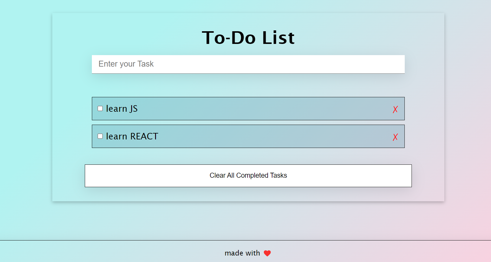

# To-Do list

> To-Do list project allows users to add, delete, and edit tasks .

</img>

## Built With

- HTMl5
- CSS3
- javaScript
- webPack

## Live Demo (if available)

[Live Demo Link](https://melodic-malasada-3d18c8.netlify.app/)

## Getting Started

To get a local copy up and running follow these simple example steps.

### Prerequisites
- Create Github repository
- Have VSCode or choice text editor installed
- Have Git installed
- HTML/CSS Linters
- Good github workflow
- `open index.html file` .
  

### Setup
- `Git clone git@github.com:TahenyBELGUITH/toDoListTemplate.git`
- `cd toDoListTemplate`
- open file in preferred editor
- Edit to your satisfaction
- HTML, CSS Linter configuration - https://github.com/microverseinc/linters-config/tree/master/html-css

## Authors
👩 **Taheny Belguith**

- GitHub: [@TahenyBELGUITH](https://github.com/TahenyBELGUITH)
- Twitter: [@BelguithTaheny](https://twitter.com/BelguithTaheny)
- LinkedIn: [belguith taheny](https://www.linkedin.com/in/belguith-taheny-47b93a162/)

## 🤝 Contributing

Contributions, issues, and feature requests are welcome!

Feel free to check the [issues page](../../issues/).

## Show your support

Give a ⭐️ if you like this project!

## Acknowledgments

- [Microverse](https://github.com/microverseinc)

## 📝 License

This project is [MIT](./MIT.md) licensed.
